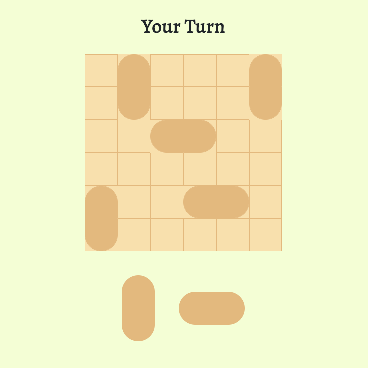

# [Multiplayer Board Game](https://cranky-archimedes-b49980.netlify.app/)

Table of Contents

- [About](#about)
  - [Built With](#built-with)
- [Usage](#usage)
  - [Game Instructions](#game-instructions)
- [Acknowledgements](#acknowledgements)

## About

A simple board game in which two people can play against each other over the internet. 

### Built With

- [Socket.IO](https://socket.io/)
- [Node.js](https://nodejs.org/en/)
- Javascript
- Bootstrap 
- HTML
- CSS

## Usage

- The game will be played between two players.
- One player will have to start the game.
- The player who starts the game will receive a room-id.
- The player who wants to join can join with the room-id which the other player received.
- At any instance, atmost 100 rooms can be active. This means that at any instance atmost 200 people can play.
- To move a domino to a certain location, you will have to drag it.

### Game Instructions

- You are given a 6 X 6 board which is initially empty.
- The player who starts the game will have to make the first move.
- In every move, the player whose turn it is will have to place a domino either horizontally or vertically at any available space.
- If the current player cannot place the domino, he loses.

## Acknowledgements
Thanks for these awesome resources that were used during the development of this game and also this README:
- <https://youtu.be/ppcBIHv_ZPs>
- <https://youtu.be/M9RDYkFs-EQ>
- <https://youtu.be/U64vIhh0TyM>
- <https://github.com/kubowania/battleships>
- <https://github.com/dec0dOS/amazing-github-template>
- <https://github.com/matiassingers/awesome-readme>
